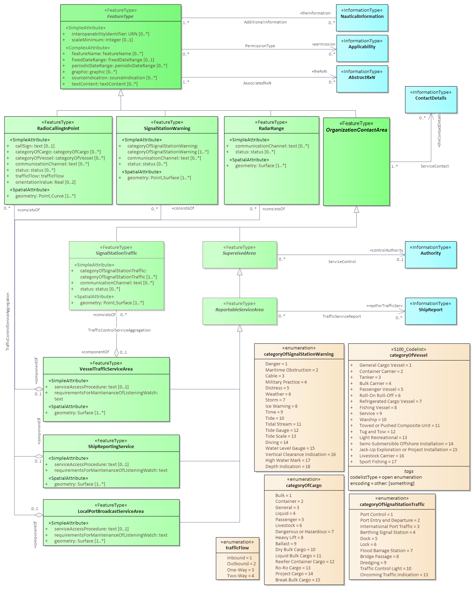
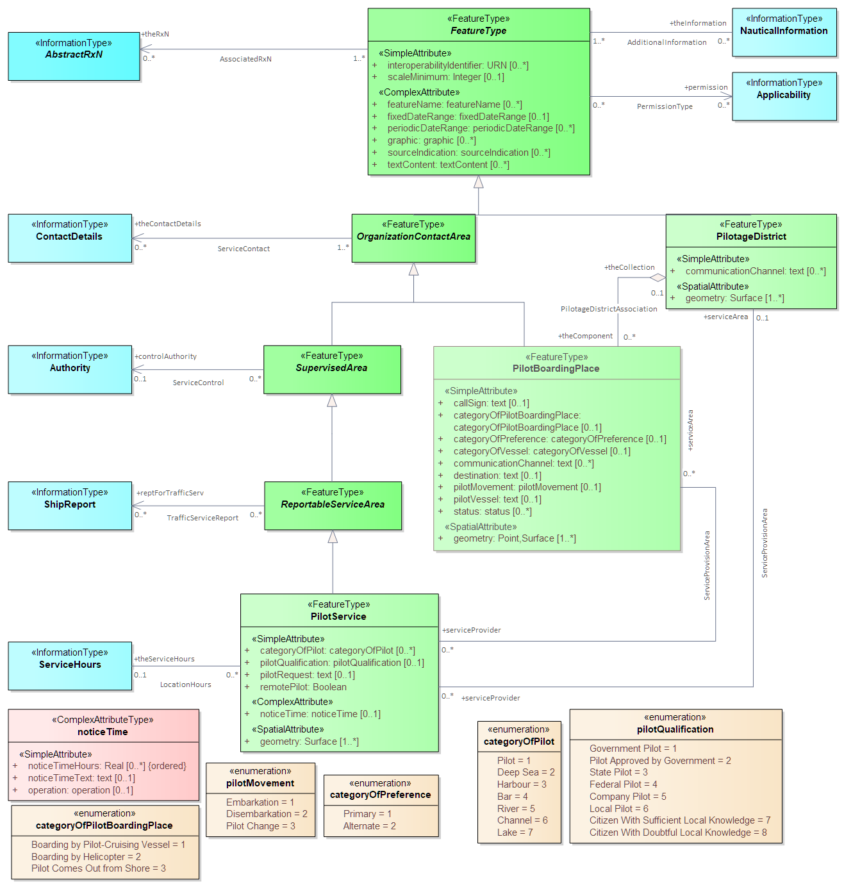

<<<
// [[sec_domain_features]]
// == Domain Features

[[sec_routeing_measures]]
== Routeing Measures

=== Introduction

Routeing measures in S-127 are an abstraction of S-101 features describing traffic separation schemes, traffic routes, and navigation lines (or "transits"
as they are called in some publications).
In S-127 there is a single *RouteingMeasure* feature which serves to indicate the presence of a defined route, derived directly from the top-level
abstract feature type (<<fig_routeing_measure>>).

[[fig_routeing_measure]]
.Routeing measures model
image::../images/S127-Routeing&#32;measures.png[]

include::features/RouteingMeasure.adoc[]

<<<
[[sec_vts_features]]
== Vessel Traffic Service Areas and Related Features
=== Introduction

These are a collection of features for VTS, ship reporting services, and local port broadcast sevices, with supporting features for calling-in points,
signal stations and radar ranges. <<fig_VTS>> depicts the features and information types which may be associated to them.

[[fig_VTS]]
.VTS areas and related features

include::features/LocalPortBroadcastServiceArea.adoc[]

include::features/RadarRange.adoc[]

include::features/RadioCallingInPoint.adoc[]

include::features/ShipReportingServiceArea.adoc[]

include::features/SignalStationTraffic.adoc[]

include::features/SignalStationWarning.adoc[]

include::features/VesselTrafficServiceArea.adoc[]

<<<
[[sec_waterlevel_features]]
== Water Levels and Underkeel Clearance
=== Introduction

S-127 representations of areas where special provisions are made for underkeel clearance are limited to indicating the areas where such provisions
may apply. The S-127 features should not be used as a substitute for S-129 underkeel clearance information where S-129 data is available. 

[[fig_UKC]]
.Underkeel clearances
image::../images/S127-UKC-WaterLevels.png[]

include::features/UnderkeelClearanceAllowanceArea.adoc[]

include::features/UnderkeelClearanceManagementArea.adoc[]

include::features/WaterwayArea.adoc[]

<<<
[[sec_pilotage_features]]
== Pilot Services
=== Introduction

The S-127 model of pilotage, depicted in <<fig_Pilotage>> is capable of representing:

* information about boarding places, districts, services, contacts and hours of availability
* notice times and formats for pilot requests
* regulations, recommendations, restrictions and general information pertaining to pilotage rules, requirements, and pilotage-related information

[[fig_Pilotage]]
.Pilot services

include::features/PilotageDistrict.adoc[]

include::features/PilotBoardingPlace.adoc[]

include::features/PilotService.adoc[]

<<<
[[sec_other_features]]
== Other Areas
=== Introduction

S-127 provides additional geographic features for encoding information relevant to traffic and routeing, not classified under the preceding heads.
<<fig_misc_features>> depicts these features. The functions and encodings of these features are described in their respective clauses following.

[[fig_misc_features]]
.Miscellaneous features
image::../images/S127-Other&#32;Areas.png[]

include::features/CautionArea.adoc[]

include::features/ConcentrationOfShippingHazardArea.adoc[]

include::features/ISPSCodeSecurityLevel.adoc[]

include::features/MilitaryPracticeArea.adoc[]

include::features/PiracyRiskArea.adoc[]

include::features/PlaceOfRefuge.adoc[]

include::features/RestrictedArea.adoc[]

